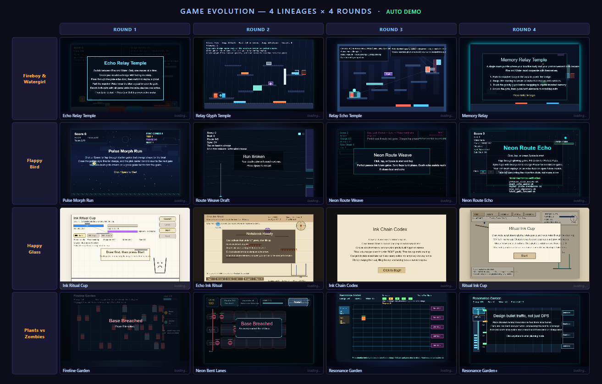

# CreativeGame: Toward Mechanic-Aware Creative Game Generation

**CreativeGame Team** | University of Bristol · Shanghai Jiao Tong University · Shandong University · Nanjing University · Sreal AI

> **[Project Page](https://yiweishi-cn.github.io/CreativeEvolutionGame/index.html)** · **[arXiv 2604.19926](https://arxiv.org/abs/2604.19926)**

---

## Overview

CreativeGame is a multi-agent system for **iterative HTML5 game generation** that treats game mechanics as explicit planning and evaluation objects rather than post-hoc descriptions. Instead of single-shot generation, the system supports inspectable version-to-version evolution through four tightly coupled ideas:

- **CreativeProxyReward** — programmatic signals dominate (85%); LLM judgment is kept auxiliary (15%)
- **Lineage-aware memory** — cross-version experience accumulates within a lineage; lineages are isolated from each other
- **Runtime validator** — deep static analysis + optional browser execution, integrated as both a repair trigger and a reward gate
- **Mechanic-guided planning** — the planner retrieves archive knowledge and emits an explicit mechanic plan *before* code generation begins

The system currently contains **71 stored lineages**, **88 saved nodes**, and a **774-entry global mechanic archive**, implemented in **6,181 lines of Python**.

---

## Demo: Four 4-Round Evolution Lineages

The following screenshot shows all four source-game lineages (rows) running live across four generation rounds (columns), with injected demo bots:



*Each game runs in the browser with an injected demo bot. This screenshot captures representative mid-play states across all four lineages.*

---

## System Architecture

The pipeline consists of **7 logical agents / 10 executable roles**:

```
Prompt + Parent Code Context
        ↓
    Planner          (retrieves lineage memory · global memory · mechanic archive)
        ↓
  Code Generation    (Skeleton → Feature → Visual Enhancer; up to 2 Refinement passes)
        ↓
 Validation & Repair (structural check → runtime test → fixer if needed)
        ↓
    Evaluation       (scores · mechanic realization · mechanic delta · novelty)
        ↓
    Reflection       (verdict · memory payload · reward signal)
        ↓
  Loop Control       (CONTINUE → next iteration | STOP → lineage save)
```

Each generation call runs up to **3 total iterations**. User-visible v1/v2/v3/v4 labels refer to separate generation calls, not internal refinement passes.

### CreativeProxyReward

```
Reward =  +0.25 × StructuralMechanicChange
          +0.20 × MechanicRealization
          +0.20 × RelativeMechanicNovelty
          +0.15 × LLM_Creativity          (auxiliary only)
          +0.10 × RuntimePlayability
          −0.15 × CosmeticOnlyPenalty
          −0.10 × RegressionPenalty

Gating:   × 0.25  if PlayabilitySanity < 0.6  (soft gate)
          × 0.50  if runtime test fails         (hard gate)
```

The three mechanic-grounded signals account for **65%** of the maximum positive weight.

### Lineage-Aware Memory (Three Layers)

| Layer | Scope | Contents |
|-------|-------|----------|
| 1 | Per-lineage | Learned memory shared across all nodes in one lineage |
| 2 | Cross-lineage | Creativity rules · game pool · 774-entry mechanic archive |
| 3 | Transient | Current-generation pipeline context |

---

## Case Studies: Four Real 4-Version Evolutions

| Source Game | Initial understanding (v1) | Mechanic reinterpretation (v2–v4) |
|---|---|---|
| **Fireboy & Watergirl** | Character-switching elemental platform puzzle with relay and timing | Reinterpreted as **memory relay**: parked bodies, replay ghosts, and gravity-imprinted echoes become the core puzzle logic |
| **Flappy Bird** | One-button obstacle dodging with precision timing | Reinterpreted as **route authoring**: perfect passes rewrite future gates, death echoes assist later runs, beat-synced phase windows change collision logic |
| **Happy Glass** | Draw-to-route fluid puzzle with physical barriers | Reinterpreted as **programmable fluid logic**: absorb strokes store droplets, release events rewrite gravity, ritual state changes how fill is counted |
| **Plants vs. Zombies** | Resource-aware lane defense with plant placement and wave management | Reinterpreted as **interception planning**: generators intentionally block allied shots, store charge, and discharge through lane bending / refraction windows |

Three common patterns emerge across all lineages:

1. The most interesting changes are **mechanic reinterpretations**, not only visual polish.
2. The system moves from **surface genre mimicry to explicit causal structure** over generations.
3. **Game understanding changes by domain**: platforming → state coordination; arcade flying → future-route shaping; physics puzzles → programmable matter; lane defense → forecast-based energy planning.

---

## Empirical Results

| Metric | Value |
|--------|-------|
| Stored lineages | 71 (9 multi-node up to depth 4, 62 single-node) |
| Saved nodes | 88 |
| Global mechanic archive entries | 774 |
| Total recorded tokens | > 4.5 × 10⁶ |
| Pipeline success rate | > 98% |
| Average creativity score | ~7.0 / 10 |
| Average evaluator playability | ~6.5 / 10 |

---

## Authors

Hongnan Ma · Han Wang · Shenglin Wang · Tieyue Yin · Yiwei Shi · Yucong Huang  
**Team Leaders:** Yingtian Zou · Muning Wen · Mengyue Yang

---

## Citation

If you find CreativeGame useful, please consider giving us a star ⭐ and citing our paper:

```bibtex
@misc{ma2026creativegametowardmechanicawarecreativegame,
      title={CreativeGame:Toward Mechanic-Aware Creative Game Generation}, 
      author={Hongnan Ma and Han Wang and Shenglin Wang and Tieyue Yin and Yiwei Shi and Yucong Huang and Yingtian Zou and Muning Wen and Mengyue Yang},
      year={2026},
      eprint={2604.19926},
      archivePrefix={arXiv},
      primaryClass={cs.AI},
      url={https://arxiv.org/abs/2604.19926}, 
}
```

---

## License

Please refer to the project page for licensing information.
